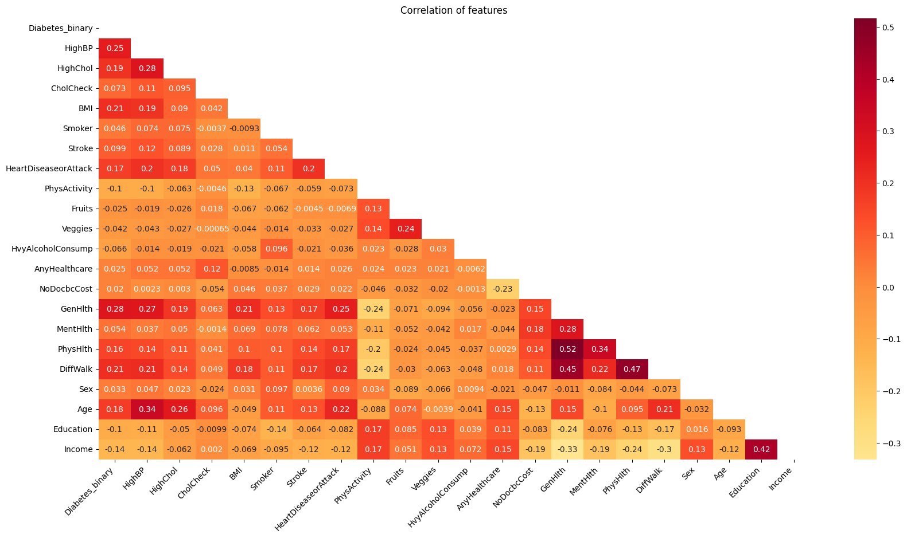
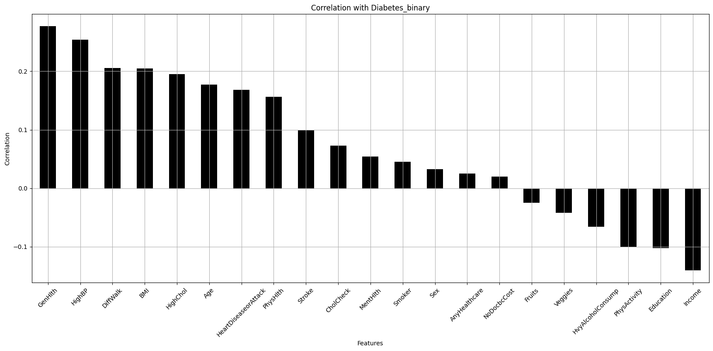

# 2024_ia651_Kamat_Mohiuddin
# Prediction of Diabetes

## Table of Contents

- [Project Overview](#project-overview)
- [Data Set](#Dataset)
- [Features Description](#Features-Description)
- [Data Preprocessing](#data-preprocessing)
- [Data Analysis](#data-analysis)
- [Visualizations and Interpretations](#visualizations-and-interpretations)
- [Results](#results)
- [Conclusion](#conclusion)
- [Usage](#usage)
- [Repository Structure](#repository-structure)
- [References](#references)

## Project Overview
An estimated 34.2 million Americans suffer from a group of diseases known as diabetes. Diabetes occurs when the body is unable to make or use insulin as it should. The pancreas secretes insulin, which controls blood glucose levels, also commonly referred to as blood sugar. Blood sugar levels must remain within a certain range for an individual; both high and low blood sugar levels can result in serious health issues, including organ damage.

Numerous risk factors have been linked to an increased risk of developing diabetes, including age, weight, physical activity level, and family history. The objective of this research is to identify and develop a strong predictive model by employing advanced techniques to pinpoint individuals who are at an elevated risk of developing diabetes.

In order to identify underlying patterns and correlations that contribute to the onset of diabetes, this study makes use of a large dataset. In addition to highlighting the importance of early prediction and prompt intervention through analytics, it aims to identify and validate the key risk factors and predictors linked to the illness. This study emphasizes how data-driven approaches can be used to effectively manage and prevent diabetes.

## Dataset
For the analysis, we have used the Center for Disease Control and Prevention (CDC) Behavioral Risk Factor Surveillance System (BRFSS) Diabetes dataset of the year 2015. The BRFSS is an extensive telephone survey on health-related topics that gathers information on a range of health issues and risky behaviors among Americans. One of the largest public health datasets currently accessible is the 2015 BRFSS dataset, which includes responses from more than 400,000 adults nationwide. This dataset contains a wide range of variables relevant to diabetes research, including lifestyle factors (physical activity, dietary habits, alcohol consumption), health-related variables (BMI, general health status, physical health status, and history of heart disease), and demographic data (age, gender, race, education level, and income).

### Features:
- Diabetes_Binary: Whether an individual has diabetes (1) or not (0).
- HighBP: High blood pressure indicator.
- HighChol: High cholesterol indicator.
- CholCheck: Whether cholesterol check was done in the past five years.
- BMI: Body Mass Index.
- Smoker: Smoking status.
- Stroke: History of stroke.
- HeartDiseaseorAttack: History of heart disease or attack.
- PhysActivity: Physical activity status.
- Fruits: Fruit consumption status.
- Veggies: Vegetable consumption status.
- HvyAlcoholConsump: Heavy alcohol consumption status.
- AnyHealthcare: Access to any healthcare.
- NoDocbcCost: Did not see a doctor due to cost.
- GenHlth: General health status (1 = Excellent to 5 = Poor).
- MentHlth: Number of days mental health was not good in the past 30 days.
- PhysHlth: Number of days physical health was not good in the past 30 days.
- DiffWalk: Difficulty walking.
- Sex: Sex of the individual (0 = Female, 1 = Male).
- Age: Age group (represented in decimal values, e.g., 2.5 for age group 18-24, 3.5 for 25-29, etc.).
- Education: Education level (1 to 6).
- Income: Income level (2 to 8).

## Data Preprocessing
Data preprocessing steps involved handling missing values, encoding categorical variables, and scaling features to ensure consistency and improve model performance. 

Data preprocessing is a critical step in predictive analytics, ensuring the quality and integrity of the dataset ’Diabetes binary’ for subsequent analysis. The preprocessing phase involves handling missing values using imputation techniques such as mean, median, or mode imputation, depending on the nature of the data. Numerical features like ’BMI’ and ’Age’ are normalized to a consistent range, improving the performance of machine learning algorithms. Categorical variables, including ’Sex’ and ’Education’, are converted into numerical formats using one-hot encoding or label encoding, facilitating their use in predictive models. Outliers are identified using statistical methods and visualizations (e.g., box plots) and are treated by either removing or transforming them to prevent skewing the analysis.  

Data balancing is crucial in predictive modeling to ensure that classifiers perform accurately across all classes, especially when dealing with imbalanced datasets where some classes are underrepresented. Various data balancing techniques include resampling, which can be over sampling (adding more instances of the minority class) or undersampling (reducing instances of the majority class). Synthetic data generation methods, like SMOTE (Synthetic Minority Over sampling Technique), create artificial examples of the minority class to enrich the dataset. Ensemble methods, such as balancing class weights or using algorithms like Balanced Random Forest, adjust model training to account for class imbalance.

*Figure 1: Histogram of variables in the dataset*

# Statistical Testing Correlation Matrix

## Overview
The Correlation Matrix highlights the key correlations between health related variables and diabetes risk.

*Figure 2: Correlation Matrix*
## Key Findings

### Positive Correlations
- The variable "GenHlth" exhibits the strongest positive correlation with diabetes risk (0.28), indicating that poorer general health is notably associated with higher diabetes risk.
Other significant positive correlations include:
HighBP (0.25): higher blood pressure is linked to increased diabetes risk.
PhysHlth (0.16): worse physical health is associated with higher diabetes risk.
Age (0.18): older age is related to higher diabetes risk.

### Negative Correlations
- In contrast, variables like:
PhysActivity (-0.10): increased physical activity is associated with reduced diabetes risk.
Veggies (-0.042): greater vegetable consumption is linked to lower diabetes risk.
HvyAlcoholConsump (-0.066): lower heavy alcohol consumption is associated with reduced diabetes risk.

### Inter-Variable Correlations
- Additionally, strong inter-variable correlations are observed:
HighBP and HighChol (0.28): these health issues tend to co-occur.
GenHlth and PhysHlth (0.52): poor general health is strongly correlated with worse physical health.
GenHlth and MentHlth (0.28): poor general health is also linked with worse mental health.

*Figure 2: Correlation with Diabetes binary*

## Data Analysis 

