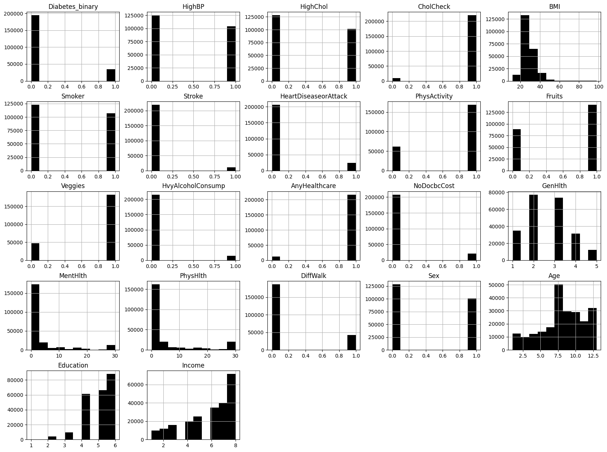

# 2024_ia651_Kamat_Mohiuddin
# Prediction of Diabetes

## Table of Contents

- [Project Overview](#project-overview)
- [Data Set](#Dataset)
- [Features Description](#Features-Description)
- [Data Preprocessing](#data-preprocessing)
- [Data Analysis](#data-analysis)
- [Visualizations and Interpretations](#visualizations-and-interpretations)
- [Results](#results)
- [Conclusion](#conclusion)
- [Usage](#usage)
- [Repository Structure](#repository-structure)
- [References](#references)

## Project Overview
An estimated 34.2 million Americans suffer from a group of diseases known as diabetes. Diabetes occurs when the body is unable to make or use insulin as it should. The pancreas secretes insulin, which controls blood glucose levels, also commonly referred to as blood sugar. Blood sugar levels must remain within a certain range for an individual; both high and low blood sugar levels can result in serious health issues, including organ damage.

Numerous risk factors have been linked to an increased risk of developing diabetes, including age, weight, physical activity level, and family history. The objective of this research is to identify and develop a strong predictive model by employing advanced techniques to pinpoint individuals who are at an elevated risk of developing diabetes.

In order to identify underlying patterns and correlations that contribute to the onset of diabetes, this study makes use of a large dataset. In addition to highlighting the importance of early prediction and prompt intervention through analytics, it aims to identify and validate the key risk factors and predictors linked to the illness. This study emphasizes how data-driven approaches can be used to effectively manage and prevent diabetes.

## Dataset
For the analysis, we have used the Center for Disease Control and Prevention (CDC) Behavioral Risk Factor Surveillance System (BRFSS) Diabetes dataset of the year 2015. The dataset includes 21 feature variables and the target variable ‘Diabetes_Binary’ indicates diabetes status (0: non-diabetic, 1: diabetic).

### Features:
- Diabetes_Binary: Whether an individual has diabetes (1) or not (0).
- HighBP: High blood pressure indicator.
- HighChol: High cholesterol indicator.
- CholCheck: Whether cholesterol check was done in the past five years.
- BMI: Body Mass Index.
- Smoker: Smoking status.
- Stroke: History of stroke.
- HeartDiseaseorAttack: History of heart disease or attack.
- PhysActivity: Physical activity status.
- Fruits: Fruit consumption status.
- Veggies: Vegetable consumption status.
- HvyAlcoholConsump: Heavy alcohol consumption status.
- AnyHealthcare: Access to any healthcare.
- NoDocbcCost: Did not see a doctor due to cost.
- GenHlth: General health status (1 = Excellent to 5 = Poor).
- MentHlth: Number of days mental health was not good in the past 30 days.
- PhysHlth: Number of days physical health was not good in the past 30 days.
- DiffWalk: Difficulty walking.
- Sex: Sex of the individual (0 = Female, 1 = Male).
- Age: Age group (represented in decimal values, e.g., 2.5 for age group 18-24, 3.5 for 25-29, etc.).
- Education: Education level (1 to 6).
- Income: Income level (2 to 8).

## Data Preprocessing
Data preprocessing steps involved handling missing values, encoding categorical variables, and scaling features to ensure consistency and improve model performance.

## Data Analysis 

