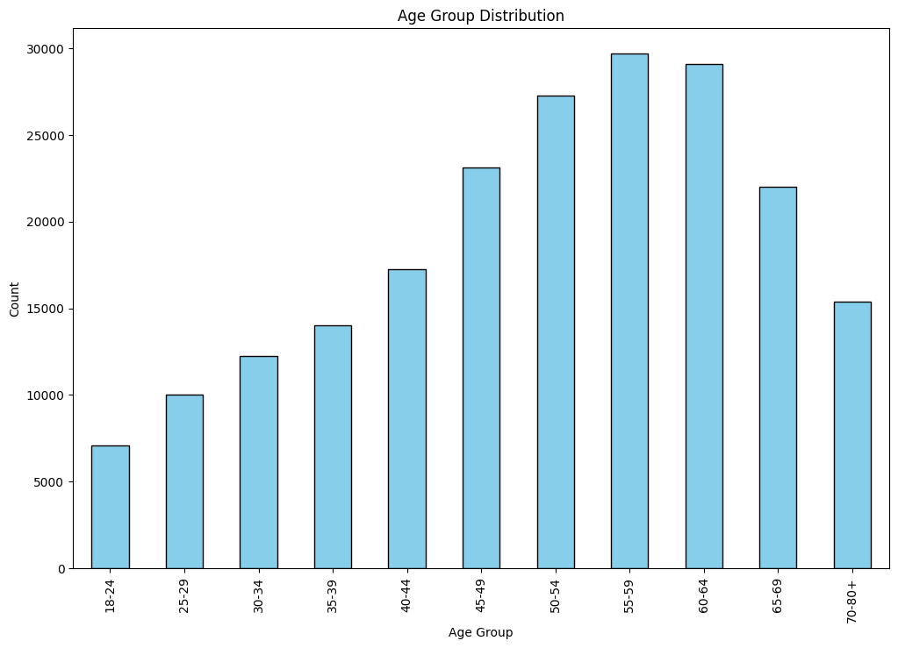
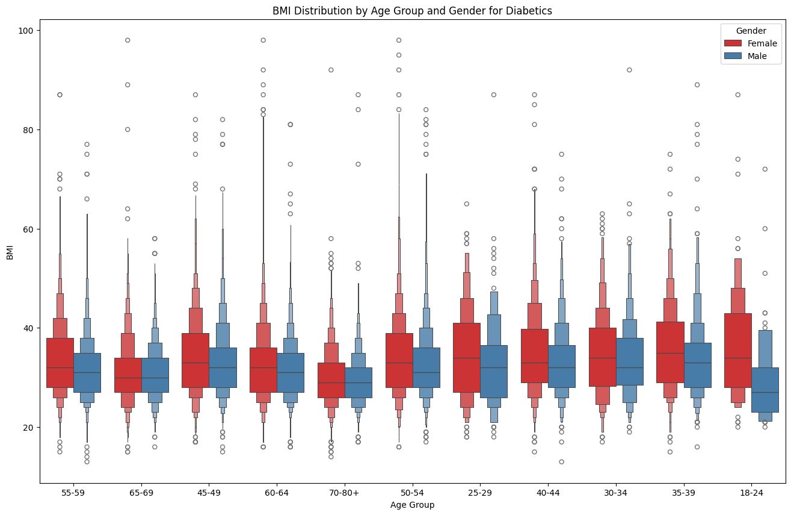
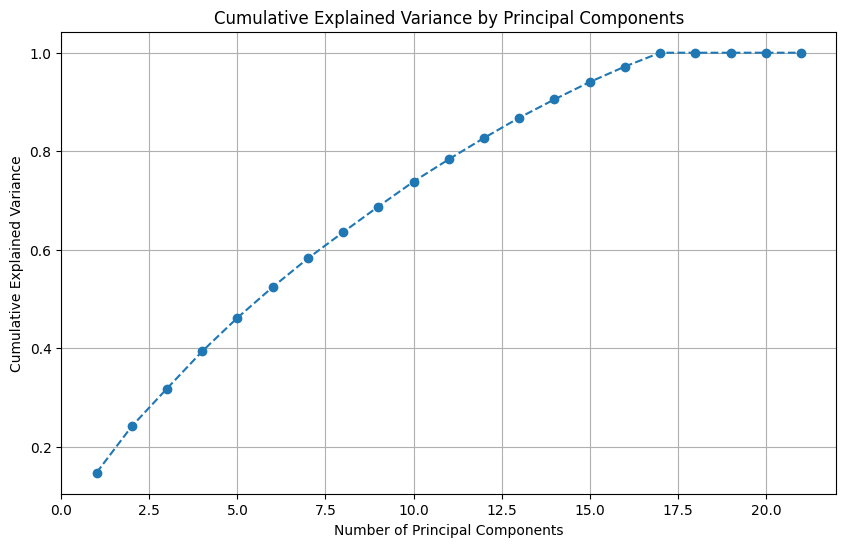
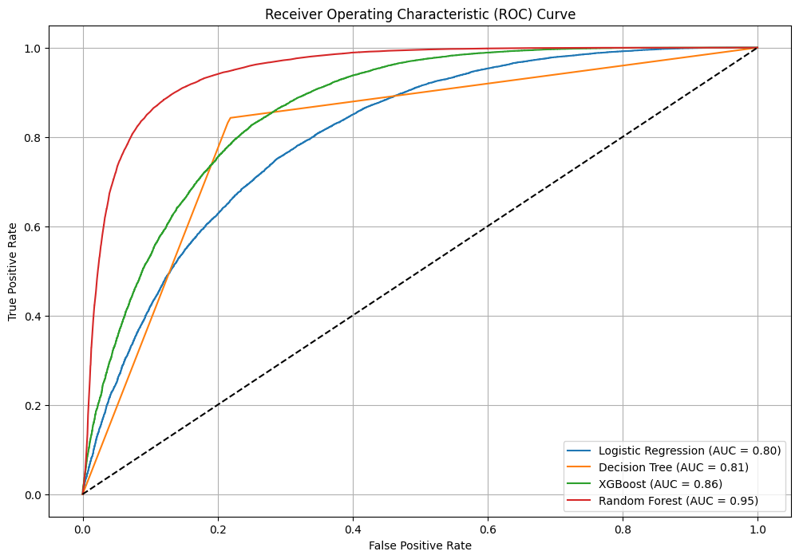
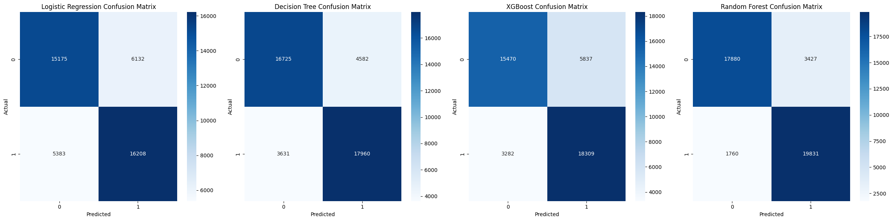
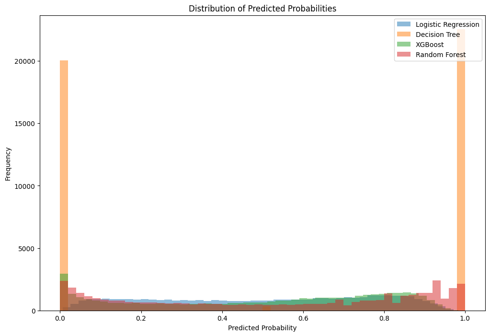

# Prediction of Diabetes
## Machine Learning 

#### Created by : Adhya Kamat & Syed Junaid Mohiuddin
#### Under the guidance of Professor Michael Gilbert & Nisar Ahamad Killedar

## Table of Contents

- [Project Overview](#project-overview)
- [Data Set](#Dataset)
- [Features](#Features)
- [Data Preprocessing](#data-preprocessing)
- [Visualizations and Interpretations](#visualizations-and-interpretations)
- [Data Analysis](#data-analysis)
- [Model Building](#Model-Building)
- [Results](#results)
- [Conclusion](#conclusion)
- [Acknowledgement](#acknowledgement)

## Project Overview
An estimated 34.2 million Americans suffer from a group of diseases known as diabetes. Diabetes occurs when the body is unable to make or use insulin as it should. The pancreas secretes insulin, which controls blood glucose levels, also commonly referred to as blood sugar. Blood sugar levels must remain within a certain range for an individual; both high and low blood sugar levels can result in serious health issues, including organ damage.

Numerous risk factors have been linked to an increased risk of developing diabetes, including age, weight, physical activity level, and family history. The objective of this research is to identify and develop a strong predictive model by employing advanced techniques to pinpoint individuals who are at an elevated risk of developing diabetes.

In order to identify underlying patterns and correlations that contribute to the onset of diabetes, this study makes use of a large dataset. In addition to highlighting the importance of early prediction and prompt intervention through analytics, it aims to identify and validate the key risk factors and predictors linked to the illness. This study emphasizes how data-driven approaches can be used to effectively manage and prevent diabetes.

## Dataset
For the analysis, we have used the Center for Disease Control and Prevention (CDC) Behavioral Risk Factor Surveillance System (BRFSS) Diabetes dataset of the year 2015. The BRFSS is an extensive telephone survey on health-related topics that gathers information on a range of health issues and risky behaviors among Americans. One of the largest public health datasets currently accessible is the 2015 BRFSS dataset, which includes responses from more than 400,000 adults nationwide. This dataset contains a wide range of variables relevant to diabetes research, including lifestyle factors (physical activity, dietary habits, alcohol consumption), health-related variables (BMI, general health status, physical health status, and history of heart disease), and demographic data (age, gender, race, education level, and income).

## Features:

| Column              | Description                                                                         |
|---------------------|-------------------------------------------------------------------------------------|
| Diabetes_Binary     | Whether an individual has diabetes (1) or not (0).                                   |
| HighBP              | High blood pressure indicator.                                                       |
| HighChol            | High cholesterol indicator.                                                          |
| CholCheck           | Whether cholesterol check was done in the past five years.                           |
| BMI                 | Body Mass Index.                                                                     |
| Smoker              | Smoking status.                                                                      |
| Stroke              | History of stroke.                                                                   |
| HeartDiseaseorAttack| History of heart disease or attack.                                                  |
| PhysActivity        | Physical activity status.                                                            |
| Fruits              | Fruit consumption status.                                                            |
| Veggies             | Vegetable consumption status.                                                        |
| HvyAlcoholConsump   | Heavy alcohol consumption status.                                                    |
| AnyHealthcare       | Access to any healthcare.                                                            |
| NoDocbcCost         | Did not see a doctor due to cost.                                                    |
| GenHlth             | General health status (1 = Excellent to 5 = Poor).                                   |
| MentHlth            | Number of days mental health was not good in the past 30 days.                       |
| PhysHlth            | Number of days physical health was not good in the past 30 days.                     |
| DiffWalk            | Difficulty walking.                                                                  |
| Sex                 | Sex of the individual (0 = Female, 1 = Male).                                        |
| Age                 | Age group (represented in decimal values, e.g., 2.5 for age group 18-24, 3.5 for 25-29, etc.). |
| Education           | Education level (1 to 6).                                                            |
| Income              | Income level (2 to 8).                                                               |

## Data Preprocessing
Data preprocessing steps involved handling missing values, encoding categorical variables, and scaling features to ensure consistency and improve model performance. 

Data preprocessing is a critical step in predictive analytics, ensuring the quality and integrity of the dataset ’Diabetes binary’ for subsequent analysis. The preprocessing phase involves handling missing values using imputation techniques such as mean, median, or mode imputation, depending on the nature of the data. Numerical features like ’BMI’ and ’Age’ are normalized to a consistent range, improving the performance of machine learning algorithms. Categorical variables, including ’Sex’ and ’Education’, are converted into numerical formats using one-hot encoding or label encoding, facilitating their use in predictive models. Outliers are identified using statistical methods and visualizations (e.g., box plots) and are treated by either removing or transforming them to prevent skewing the analysis.  

Data balancing is crucial in predictive modeling to ensure that classifiers perform accurately across all classes, especially when dealing with imbalanced datasets where some classes are underrepresented. Various data balancing techniques include resampling, which can be over sampling (adding more instances of the minority class) or undersampling (reducing instances of the majority class). Synthetic data generation methods, like SMOTE (Synthetic Minority Over sampling Technique), create artificial examples of the minority class to enrich the dataset. Ensemble methods, such as balancing class weights or using algorithms like Balanced Random Forest, adjust model training to account for class imbalance.

*Figure 1: Histogram of variables in the dataset*

## Visualizations and Interpretations 

### Correlation Matrix

The Correlation Matrix highlights the key correlations between health related variables and diabetes risk.

*Figure 2: Correlation Matrix*

## Key Findings

### Positive Correlations
- The variable "GenHlth" exhibits the strongest positive correlation with diabetes risk (0.28), indicating that poorer general health is notably associated with higher diabetes risk.
Other significant positive correlations include:
HighBP (0.25): higher blood pressure is linked to increased diabetes risk.
PhysHlth (0.16): worse physical health is associated with higher diabetes risk.
Age (0.18): older age is related to higher diabetes risk.

### Negative Correlations
- In contrast, variables like:
PhysActivity (-0.10): increased physical activity is associated with reduced diabetes risk.
Veggies (-0.042): greater vegetable consumption is linked to lower diabetes risk.
HvyAlcoholConsump (-0.066): lower heavy alcohol consumption is associated with reduced diabetes risk.

### Inter-Variable Correlations
- Additionally, strong inter-variable correlations are observed:
HighBP and HighChol (0.28): these health issues tend to co-occur.
GenHlth and PhysHlth (0.52): poor general health is strongly correlated with worse physical health.
GenHlth and MentHlth (0.28): poor general health is also linked with worse mental health.

*Figure 3: Correlation with Diabetes binary*

 - HighBP and Age: There is a strong positive correlation (0.34) between High Blood Pressure (HighBP) and Age, indicating that older individuals are more likely to have high blood pressure.
 - PhysHlth and DiffWalk: Physical Health (PhysHlth) and Difficulty Walking (DiffWalk) are highly correlated (0.47). This suggests that individuals with poorer physical health are more likely to experience difficulty walking.
 - Income and Education: Income and Education show a notable positive 
correlation (0.42), implying that higher education levels are associated with higher income.

## Data Analysis

### Diabetes Distribution among Age and Gender

*Figure 4 : Diabetes Distribution among Age and Gender*

- Increase in Diabetes with Age: The proportion of individuals with diabetes increases significantly with age. The youngest age group (18-24) has the lowest proportion of diabetes, while the oldest age group (70-80+) has the highest.
- Gender Disparities: Across all age groups, males consistently have a higher proportion of diabetes compared to females. This gender disparity is evident in each age bracket, with males showing a higher prevalence.
- Significant Increase in Older Age Groups: The most notable increase in diabetes prevalence occurs in the age groups 55-59 and above. The proportion of individuals with diabetes rises sharply from this age group onwards, highlighting the higher risk of diabetes in older populations.

### BMI Distribution by Age group and Gender for Diabetics

*Figure 5: BMI Distribution by Age group and Gender for Diabetics*

- Higher BMI in Middle Age Groups : The median BMI is higher for middle-aged groups (40-49, 50-54) compared to younger and older age groups. This suggests that middle-aged diabetic individuals tend to have higher BMI.
- Gender Differences: In most age groups, the BMI distribution between males and females is relatively similar, with overlapping interquartile ranges. However, there are slight differences in median BMI between genders in certain age groups, such as females having a higher median BMI in the 18-24 and 25-29 age groups.
- Outliers in BMI: There are significant outliers in BMI across all age groups, indicating a wide range of BMI values among diabetic individuals. Some individuals in the 60-64 and 65-69 age groups have particularly high BMI values, exceeding 60.
 
### PCA
 

*Figure 6: PCA PLOT*

PCA Plot Analysis: The PCA plot is a valuable tool to determine the number of principal components to retain in order to achieve a balance between reducing dimensionality and maintaining the integrity of the dataset.

- Conclusion: This PCA analysis shows that 15 principal components account for 95 percent of the dataset’s variance. Because of this, it is a sensible option for dimensionality reduction that preserves the majority of the variability found in the original data.

## Model Building

### Classification Models for Diabetes Prediction:
1. Logistic Regression: Logistic Regression is a widely used model due to its simplicity and interpretability. It estimates the probability of diabetes occurrence based on input features and provides clear insights into how each factor influences risk.
2. Decision Trees: Decision Trees offer a visual and straightforward approach by splitting data into branches based on feature values, making it easy to understand decision paths and interactions between variables.
3. Random Forest Classifier: Random Forest, an ensemble method of multiple decision trees, improves predictive accuracy and handles complex interactions and variable relationships more robustly.
4. XGBoost Classifier: Known for its high performance and efficiency in handling large datasets, the XGBoost Classifier is a potent gradient boosting algorithm. By combining several weak learners optimally and controlling overfitting, it improves predictive accuracy.

### Optimization of a Random Forest Classifier

- Within the dataset, we found categorical features of type float64 that contained more than two unique values. Preprocessing was necessary for these features to function well in the model.
- OneHotEncoder was used to build a preprocessing pipeline that converted the categorical features into a format that could be used with machine learning algorithms. 
- Next, we developed a machine learning pipeline that comprised the RandomForestClassifier for classification along with the preprocessing stages. The preprocessing steps were applied consistently in the training and prediction phases thanks to this pipeline.
- We defined a grid of hyperparameters, such as the number of trees (n_estimators), the maximum depth of the trees (max_depth), the minimum number of samples needed to split a node (min_samples_split), and the minimum number of samples needed at a leaf node (min_samples_leaf), in order to optimize the RandomForestClassifier's performance.
- Eighty percent of the dataset was used for testing, and the remaining twenty percent was used for training. In order to optimize for accuracy, we conducted a thorough search over the hyperparameter grid using GridSearchCV with 5-fold cross-validation.

The best hyperparameters found were:

- Maximum depth of trees: 20
- Minimum samples at a leaf node: 1
- Minimum samples required to split a node: 2
- Number of trees in the forest: 100

During the grid search, these hyperparameters yielded the best accuracy, guaranteeing a reliable and well-calibrated predictive model for diabetes identification.

### ROC Curve (Receiver Operating Characteristic)

*Figure 7: ROC Curve*

- The ROC curves of four distinct models—Logistic Regression, Decision Tree, XGBoost, and Random Forest—are compared in this figure.
Interpretation
- Logistic Regression (AUC = 0.80): The curve shows a reasonable trade-off between true positive rate and false positive rate, indicating moderate performance.
- Compared to Logistic Regression, Decision Tree (AUC = 0.81) exhibits slightly better model discrimination.
- XGBoost (AUC = 0.86): Notably superior, signifying a greater capacity to differentiate between the classes.
- The best-performing model is Random Forest (AUC = 0.95), whose curve is closest to the upper left corner, indicating exceptional discriminating power.

### Confusion Matrices

*Figure 8: Confusion Matrix*

- Overview: These matrices show performance of each model with respect to true positives, true negatives, false positives, and false negatives.
Interpretation:
Logistic Regression:
True Negatives: 15175
False Positives: 6132
False Negatives: 5383
True Positives: 16208
- The model's intermediate precision and recall are reflected in the balance of false positives and false negatives.

Decision Tree:
True Negatives: 16725
False Positives: 4582
False Negatives: 3631
True Positives: 17960
- Compared to Logistic Regression, this model exhibits a better balance, with fewer false positives and false negatives.

XGBoost Classifier:
True Negatives: 15470
False Positives: 5837
False Negatives: 3282
True Positives: 18309
- This model works well, particularly with regard to lowering false negatives.

Random Forest Classifier:
True Negatives: 17880
False Positives: 3427
False Negatives: 1760
True Positives: 19831
- This model has performed the best with the highest true positives and lowest false negatives and false positives, indicating high precision and recall.

### Distribution of Predicted Probabilities

*Figure 9: Distribution of Predicted Probabilities*

The distribution of expected probability for each model is displayed in this graphic.
Interpretation:
- With peaks at 0 and 1, the distribution of a logistic regression is comparatively even but suggests some degree of prediction certainty.
- Decision Tree: High peaks at 0 and 1 can indicate overfitting but also high forecast certainty.
- XGBoost: More dispersed, suggesting a more sophisticated method of probability forecasting.
- Random Forest: Reliability of probability estimates and reduced overfitting are shown by a better spread compared to Decision Trees.

### Model Performance Metrics

## Model Performance Metrics

| Metric                      | Logistic Regression | Decision Tree | XGBoost | Random Forest |
|-----------------------------|---------------------|---------------|---------|---------------|
| Accuracy                    | 0.73                | 0.81          | 0.79    | 0.88          |
| Precision                   | 0.73                | 0.80          | 0.76    | 0.85          |
| Recall                      | 0.75                | 0.83          | 0.85    | 0.92          |
| AUC                         | 0.80                | 0.81          | 0.86    | 0.95          |
| Cross-Validation AUC (avg.) | 0.81                | 0.81          | 0.86    | 0.95          |

### Model Summaries

#### Logistic Regression
- **Performance**: Mediocre
- **Description**: The model can differentiate between the classes to a moderate extent, as indicated by the AUC, and it strikes a reasonable balance between recall and precision.

#### Decision Tree
- **Performance**: Better than Logistic Regression
- **Description**: With more accuracy, precision, and recall than logistic regression, the decision tree model performs better. It appears to have superior class discrimination abilities based on the AUC.

#### XGBoost
- **Performance**: Good
- **Description**: XGBoost performs well, particularly when it comes to recall and AUC. It is a little less precise than the Decision Tree, but it still finds genuine positives quite well.

#### Random Forest
- **Performance**: Exceptional
- **Description**: All other models are outperformed by Random Forest. With the best accuracy, precision, recall, and AUC, it performs exceptionally well across the board in the classification domain.

## Conclusion

- Based on all the evaluated metrics, we can conclude that the Random Forest model performs the best.

- Highest Accuracy: 0.88
- Highest Precision: 0.85
- Highest Recall: 0.92
- Highest AUC: 0.95
- Consistent Cross-Validation Performance: Average AUC of 0.95

- These measurements show that the Random Forest model performs better than the other models in terms of correctly predicting the target variable while keeping precision and recall in check. Hence, it is clearly recommended for this classification task.

## Future Scope

- Advancements in Data Science and Machine Learning: The future of diabetes prediction projects is set to be significantly enhanced by advancements in data science and machine learning, offering greater accuracy and effectiveness in both disease prevention and early detection.
- Sophisticated Algorithms: Sophisticated algorithms, such as deep learning neural networks, are anticipated to play a crucial role by analyzing complex, non-linear relationships within high-dimensional data, which traditional models might struggle to capture. These deep learning models, including convolutional neural networks (CNNs) and recurrent neural networks (RNNs), can process large volumes of heterogeneous data, including medical imaging, electronic health records, and genetic information, to improve prediction precision.
- Integration of Multi-Omics Data: Developments in transcriptomics, proteomics, metabolomics, and genomics are expected to offer a more thorough knowledge of the biological foundations of diabetes. Predictive models can learn more about the intricate relationships between genes, proteins, and metabolites by combining various multi-omics datasets. This can result in more accurate risk assessments and individualized preventative plans.
- Natural Language Processing (NLP) Advances: Utilizing natural language processing (NLP) techniques, more and more important data is being extracted from unstructured data sources like patient forums, research articles, and medical notes. Predictive models can improve risk prediction and personalized care by utilizing a wider range of data, such as newly discovered research findings and patient-reported outcomes, by utilizing NLP.

## Acknowledgment

- We would like to sincerely thank Professor Michael Gilbert & Nisar Ahamad Killedar, for their invaluable advice and assistance with this machine learning project. Their professional guidance, helpful criticism, and encouragement have been crucial to the accomplishment of this work. We sincerely appreciate their commitment and guidance.

